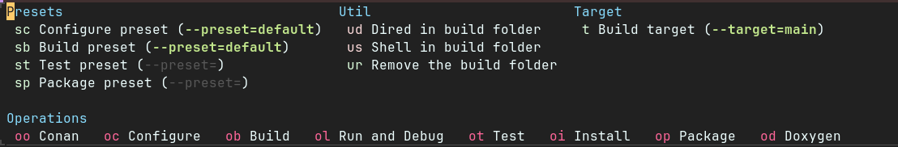
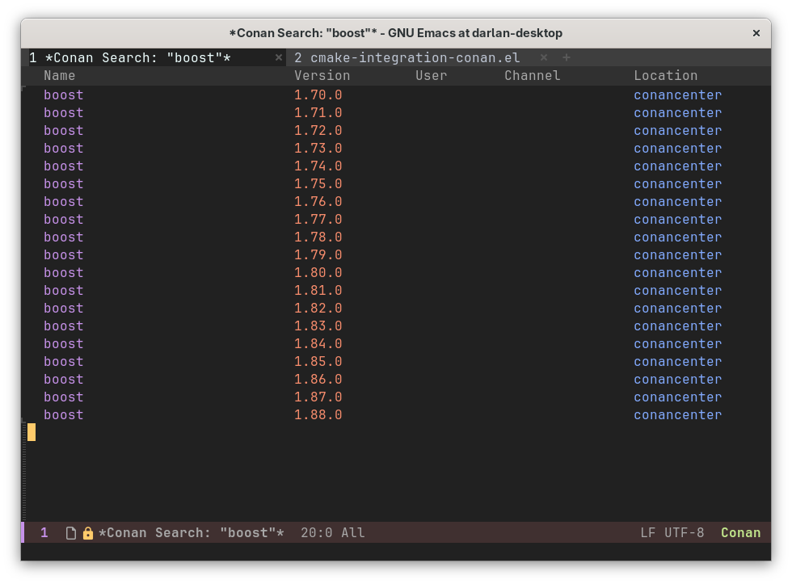

# CMake Integration for Emacs

This package provides seamless integration between Emacs and CMake-based C++ projects by leveraging CMake's project
information. It simplifies common development tasks such as:

- **Preset Management:** Easily select and apply CMake configure, build, test, and package presets.
- **Target Compilation:** Compile specific targets within your project with a single keybinding.
- **Debugging:** Easily start debugging your executable targets with the classic gdb mi interface or with gdb through
  [dape](https://github.com/svaante/dape).
- **Conan Integration:** Manage Conan packages and remotes directly from Emacs, call ``conan install`, etc..
- **Language Servers:** Help language servers work correctly in the project.

## Core Concepts

- **Relies on native Emacs features**: This package treats as a project whatever the built-in `project` package recognizes.
  It assumes the top-level `CMakeLists.txt` is at the project root. If the root also contains `CMakePresets.json` and/or
  `CMakeUserPresets.json`, they are read to collect preset names.
- **CMake File API:** This package relies on CMake's File API to query project information, such as available targets,
  build configurations, and presets. This allows for dynamic and accurate introspection of your project.
- **CMake Presets:** CMake presets provide a standardized way to configure build environments. This package allows you
  to select and apply these presets efficiently.
- Make the common operations when working with C++ simpler, such as configuring a project, compiling a target, running
  an executable, etc..

## Installation

The package is available on GitHub. You can install it using your preferred Emacs package manager:

- **Example using use-package (with elpaca):**
    ```emacs-lisp
    (use-package cmake-integration
      :ensure (cmake-integration :type git :host github 
                                 :repo "darcamo/cmake-integration"))
    ```

- **Use-package with `vc` backend:**
    ```emacs-lisp
    (use-package cmake-integration
      :vc (:url "https://github.com/darcamo/cmake-integration.git"
           :rev :newest))
    ```

## Usage

The package provides a transient menu (`cmake-integration-transient`) for quick access to its functions. For an
efficient workflow, consider binding frequently used commands to custom keybindings.



Note: Try experimenting with with the transient menu to get a better idea about all the functionality.

### Basic Workflow

1.  **Configure Project:**
    - Use `cmake-integration-select-configure-preset` to choose a CMake configure preset. It lists all available
      configure presets and prompts you to select one.
      - **TIP:** If a preset has the `displayName` field defined, its value is used as annotation.
      - **TIP:** CMake supports various preset types (configure, build, test, package). When you select a configure
        preset, `cmake-integration` will automatically try to select a matching preset for the other types.
    - Use `cmake-integration-cmake-reconfigure` to configure the project. This generates necessary files for the CMake
      File API.
    - **Important:** You must configure your project at least once before target-related features can work.

2.  **Compile Target:**
    - Use `cmake-integration-select-current-target` to select a target.
    - Use `cmake-integration-save-and-compile-last-target` to compile the last selected target.
    - You can also use `cmake-integration-save-and-compile` to select a target and compile it in a single command.

3.  **Run Target:**
    - Use `cmake-integration-run-last-target` to execute the compiled executable.
      - **TIP:** See the documentation of the `cmake-integration-program-launcher-function` variable if you want to
        customize how the program is executed.
    - If you need to pass any command line arguments to the executable, use
      `cmake-integration-run-last-target-with-arguments` to specify custom command-line arguments and then run the
      executable. Any subsequence call to `cmake-integration-run-last-target` will use these arguments as well.

4.  **Debug Target:**
    - Use `cmake-integration-debug-last-target` to debug the last compiled executable.
      - **TIP:** See the documentation of the `cmake-integration-debug-launcher-function` variable if you want to
        customize how the program is executed (such as using [dape](https://github.com/svaante/dape) instead of the
        native gdb in Emacs).

5.  **Run Tests:**
    - You can always choose a target that has the executable for your tests and run it as usual.
    - If you want to run the tests using CTest, use `cmake-integration-run-ctest`.

### Example Keybindings

The following Emacs Lisp code demonstrates how to bind most useful commands to convenient keys, primarily within
`c++-mode`.

```emacs-lisp
(use-package cmake-integration
  :bind (:map c++-mode-map
              ([f5] . cmake-integration-transient)                         ;; Open main transient menu
              ([M-f9] . cmake-integration-select-current-target)           ;; Ask for target
              ([f9] . cmake-integration-save-and-compile-last-target)      ;; Recompile last target
              ([C-f9] . cmake-integration-run-ctest)                       ;; Run CTest
              ([f10] . cmake-integration-run-last-target)                  ;; Run last target (with saved args)
              ([S-f10] . kill-compilation)                                 ;; Stop compilation
              ([C-f10] . cmake-integration-debug-last-target)              ;; Debug last target
              ([M-f10] . cmake-integration-run-last-target-with-arguments) ;; Run last target with custom args
              ([M-f8] . cmake-integration-select-configure-preset)         ;; Select and configure preset
              ([f8] . cmake-integration-cmake-reconfigure)                 ;; Reconfigure with last preset
              ))
```

You can also add these keybindings to the global map, but that would make them available even when not working in a
CMake project, which is not very useful. A more convenient approach is to use `cmake-integration-project-mode`. It's a
minor mode without any functionality, besides having a dedicated keymap and hook. You can replace `c++-mode-map` in the
above code snippet with `cmake-integration-project-mode-map`, and then enable `cmake-integration-project-mode` in any
buffer you want the keybinds to be active.


Tip: One way to automatically enable `cmake-integration-project-mode` in any buffer which is part of a CMake project, is
to enable `global-cmake-integration-project-mode`.

## Extra Configuration

### Customize how the target executable is run

By default, when running a target executable with `cmake-integration-run-last-target` the process run in a compilation
buffer. If the program needs to read input from the user, customize the `cmake-integration-program-launcher-function`
variable with a different "launcher function". This should be a function receiving two arguments, the command that
should be run, and a name that should be used for the buffer.

The `cmake-integration-program-launcher-function` variable can also be set to one of the three symbols below, which map
to the available builtin launcher functions that should cover most use cases:

- `'compilation` (default value): Uses Emacs `compile` feature to run the command in a compilation buffer. This does not
  allow input interaction with the program being executed.
- `'comint`: Uses Emacs `compile` feature with the comint argument set to `t` to run the command in a comint buffer.
  Also switch to that buffer. This allows input interaction
- `'eshell`: Uses `eshell` to run the command in a eshell buffer.


### Customize how the debugger is run

By default, when debugging the target executabe with `cmake-integration-debug-last-target` the emacs native gdb
integration is used. You can customize the `cmake-integration-debug-launcher-function` with a different launcher
function to change this. It should be a function receiving three arguments, the path of the executabel being debugged, a
string with any command lline arguments passed to it, and the working directory.

The `cmake-integration-debug-launcher-function` variable can aso be set o one of the two symbols below, which map to the
available builtin launcher functions:

- `classic-gdb` (default value): Uses the native gdb integration in Emacs to debug the current target.
- `dape`: Uses [dape](https://github.com/svaante/dape) to debug the current target.


Other options can be easily added by creating a custom debug launcher function. The code below implements a simple
launcher function to debug using gdbgui

```emacs-lisp
(defun gdbgui-debug-launch-function (executable-path &optional args run-dir)
  "Debug EXECUTABLE-PATH with gdbgui, passign ARGS and using RUN-DIR as cwd."
    (let* ((default-directory (or run-dir default-directory))
             (gdbgui-args (format "%s %s" executable-path
                           (or args ""))))
      (start-process "gdbgui" "*gdbgui*" "gdbgui" gdbgui-args))

    ;; Start the browser to show the gdbgui interface
    (browse-url "http://127.0.0.1:5000/")
  )
```

**Note**: You will need to stop the `gdbgui` process yourself after you are done with it. You can do that by calling the
`list-processes` Emacs command and stopping the `gdbgui` process from there.


### Build Directory

By default, if you do not use presets then `cmake-integration` assumes the build folder is named `build`. If your
project uses a different build directory, set the `cmake-integration-build-dir` variable accordingly. 

If you use presets, then the build folder is taken from the `binaryDir` field in the chosen configure preset, since that
is the actual build folder that is used when compiling. `cmake-integration` can understand a few macro replacements in
the `binaryDir` field of the configure preset. The supported ones are `${sourceDir}` and `${presetName}`. Other
replacements may be added in the future, if necessary.

**TIP:** Setting `binaryDir` to something like `"${sourceDir}/build/${presetName}"` is an easy way to separate build
folders for different presets.

Note: The build folder is cached when using presets, to avoid having to read the information from the preset files
again. This is automatically cleared when you change presets. If you need to clear the cache without changing presets
(i.e., you edited the `binaryDir` field in the presets file), call the `cmake-integration-refresh-build-folder-cache`
function.


### Hiding some targets during completion

When invoking `cmake-integration-save-and-compile`, a list of targets is presented, allowing the user to select one for
compiling, running, etc. In many cases, you may only be interested in a specific subset of targets, such as executable
targets. To streamline this process, several variables can be used to filter the targets displayed during completion.
These variables are:

- `cmake-integration-include-subproject-targets-during-completion`
- `cmake-integration-hide-library-targets-during-completion`
- `cmake-integration-hide-utility-targets-during-completion`

By default, subprojects are included, and no targets are hidden. You only need to configure these variables if you want
to reduce the number of targets shown during completion, which can be useful for improving performance in large projects
(mainly during the initial run, as the target list is cached thereafter). Additionally, even if these variables are set
to filter the target list, you can temporarily override them and display all targets by pressing `C-u C-u` before
executing `cmake-integration-save-and-compile`.

### Project Configuration (non-version controlled projects or monorepos)

`cmake-integration` uses Emacs's `project` infrastructure to determine the project root (Git repositories are detected
automatically). If you're not using version control or need a custom root within a Git repository, you can use a
`.project` file. Emacs's `project` package can be extended to recognize directories containing an empty `.project` file
(actually any file with a specific name) as project roots by adding that filename to the `project-vc-extra-root-markers`
list (see the documentation of the `project-vc-extra-root-markers` variable).

The following Emacs Lisp code demonstrates how to achieve this:

```emacs-lisp
(add-to-list 'project-vc-extra-root-markers ".project")
```


### Speed-up obtaining the list of targets

Obtaining the list of targets is likely the slowest operation in `cmake-integration`, especially if there are many
targets or you are working remotely via TRAMP. This is because `cmake-integration` reads and parses a separate JSON file
for each target to annotate them with their target types in the completion list. If this process is too slow for your
use case and you'd rather avoid the performance cost, you can set `cmake-integration-annotate-targets` to `nil`. To
apply this setting only to a specific project, configure it as a directory-local variable.

Note: This information is cached after the first retrieval. This cache can also be saved/restored when appropriated (see
the [Persisting state](#persisting-state) section). If you need to clear the cache for some reason, call the
`cmake-integration-refresh-target-cache` function.

## Integration with language servers

`cmake-integration` supports the `clangd` and `qmlls` language servers (more could be added in the future). This
functionality allows it to update the configuration files used by these servers whenever the build directory changes,
ensuring they operate correctly. Refer to the variables `cmake-integration-setup-clangd` and
`cmake-integration-setup-qmlls` for more details.

## Integration with the Conan Package Manager

### Running Conan

- **During CMake Configuration:** When you run `cmake-integration-cmake-configure-with-preset` or
  `cmake-integration-cmake-reconfigure`, passing a prefix argument (`C-u`) will first execute `conan install` in the
  build directory before configuring with CMake.
- **Standalone:** Use `cmake-integration-run-conan` to execute `conan install` in the last used build folder.

### Conan Arguments and Profiles

- **`cmake-integration-conan-arguments`:** Set this variable to pass arguments to `conan install`. The default is
  `--build missing`.
- **`cmake-integration-conan-profile`:** Configure this variable to specify a Conan profile. It can be:
    - A string with the profile name (e.g., `"default"`).
    - An alist mapping CMake preset names to Conan profile names (e.g., `'(("my-cmake-preset" . "my-conan-profile"))`).

### Managing Conan Remotes

Use `cmake-integration-conan-manage-remotes` to interact with Conan remotes:

- **Add Remote (`a` or `+`):** Prompts for remote name and URL.
- **Delete Remote (`D`):** Deletes selected or marked remotes.
- **Toggle Enable (`<RET>` or `f`):** Enables or disables a remote.
- **Toggle SSL Verification (`v`):** Toggles SSL verification for a remote.
- **Access Conan Commands (`c`):** Opens a transient menu for other Conan operations.

### Displaying Conan Cache and Searching Repositories

- **`cmake-integration-conan-list-packages-in-local-cache`:** Lists locally installed Conan packages.
- **`cmake-integration-conan-search`:** Searches for packages in configured Conan repositories.

Both functions display results in a tabulated list buffer, offering operations like filtering, marking items (`m`),
deleting marked items (which triggers `conan remove` to delete a recipe from the cache), and copying item specifications
to the kill ring (`w`) for use in `conanfile.txt`. You can also mark libraries to be added to `conanfile.txt` (mark with
`i` and make the change with `x`, or use `I` to add directly). At this moment, this feature does not support adding
dependencies to `conanfile.py`.



## Debugging

To debug an executable target:

- Use `cmake-integration-debug-last-target`. This command passes any current command-line arguments to the executable
  within the debugger and sets the working directory according to `cmake-integration-run-working-directory`.

## Screenshots

**Note:** The screenshots below use the `doom-material-dark` theme with `vertico` and `marginalia` for enhanced
completion UIs.

- **Selecting a Configure Preset:** When `cmake-integration-cmake-configure-with-preset` is invoked, you'll see a list
  of available configure presets, including a "No Preset" option. The `displayName` from the preset, if available, is
  shown as an annotation.

    

- **Selecting a Target:** When `cmake-integration-save-and-compile` is called, you'll be prompted to select a target.
    The target type (executable or library) is indicated as an annotation.

    

    For multi-config generators (like Ninja Multi-Config), the target selection might look like this:

    

    The targets "all" and "clean" are always available.


## Remote Execution with TRAMP

The `cmake-integration` package supports remote connections using TRAMP, allowing for seamless integration. However, you
might need to modify your `tramp-remote-path` variable to ensure executables are accessible on the remote system.

For instance, when using `cmake-integration` with Docker and TRAMP, if Conan is located in the `/home/ubuntu/.local/bin`
directory within your Docker container, add the following line to your Emacs configuration:

```
(add-to-list 'tramp-remote-path "/home/ubuntu/.local/bin")
```

## Persisting state

`cmake-integration` offers support for saving/restoring the current state of its relevant variables. This is done by the
`cmake-integration-save-state` and `cmake-integration-restore-state` functions, respectively. The saved state includes
the last used presets, the current target, any run-time arguments for that target, and the cached list of available
targets. The storage location is controlled by the `cmake-integration-persist-location` variable; it defaults to a
project-specific directory under `user-emacs-directory`, but it can be pointed at a custom path or kept inside the
project itself.

If you prefer to save and restore state automatically, enable the global minor mode
`cmake-integration-automatic-persistence-mode`. The mode installs advices so that selecting presets, targets, running
executables, invoking CTest, and similar actions all keep the persisted data in sync automatically.

Manual commands remain available for custom workflows:

- `cmake-integration-save-state`
- `cmake-integration-restore-state`
- `cmake-integration-maybe-restore-state`

These are useful if you occasionally want to persist state without enabling the automatic mode (for example, as part of
a project-switching hook).

## Other packages you might be interested in

- [CMake Presets mode](https://github.com/darcamo/cmakepresets-mode)
  - Small usability improvements when editing CMake presets files


<!-- Local Variables: -->
<!-- fill-column: 120 -->
<!-- End: -->
