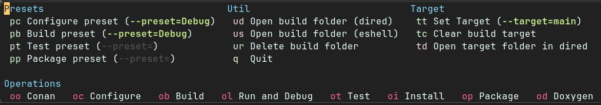

# CMake Integration for Emacs

This package provides seamless integration between Emacs and CMake-based C++ projects by leveraging CMake's project
information. It simplifies common development tasks such as:

- **Preset Management:** Easily select and apply CMake configure, build, test, and package presets.
- **Target Compilation:** Compile specific targets within your project with a single keybinding.
- **Debugging:** Launch GDB or DAP for debugging your executables.
- **Conan Integration:** Manage Conan packages and remotes directly from Emacs.
- **Language Server:** A symbolic link is automatically created from the build folder `compile_commands.json` file to the
  root of the project. This helps the `clangd` language server index correctly the project.

## Core Concepts

- **CMake File API:** This package relies on CMake's File API to query project information, such as available targets,
  build configurations, and presets. This allows for dynamic and accurate introspection of your project.
- **CMake Presets:** CMake presets provide a standardized way to configure build environments. This package allows you
  to select and apply these presets efficiently.
- Make the common operations when working with C++ simpler, such as configuring a project, compiling a target, running
  an executable, etc..

## Installation

The package is available on GitHub. You can install it using your preferred Emacs package manager:

- **Example using use-package (with elpaca):**
    ```emacs-lisp
    (use-package cmake-integration
      :ensure (cmake-integration :type git :host github 
                                 :repo "darcamo/cmake-integration")
      :commands (cmake-integration-conan-manage-remotes
                 cmake-integration-conan-list-packages-in-local-cache
                 cmake-integration-search-in-conan-center
                 cmake-integration-transient)
      :custom
      (cmake-integration-generator "Ninja")
      (cmake-integration-use-separated-compilation-buffer-for-each-target t))
    ```

- **Use-package with `vc` backend:**
    ```emacs-lisp
    (use-package cmake-integration
      :vc (:url "https://github.com/darcamo/cmake-integration.git"
                :rev :newest))
    ```

## Usage

The package provides a transient menu (=cmake-integration-transient=) for quick access to its functions. For efficient workflow, consider binding frequently used commands to custom keybindings.



### Basic Workflow

1.  **Configure Project:**
    - Use `cmake-integration-select-configure-preset` to choose a CMake configure preset. It lists all available
      configure presets and prompts you to select one.
      - **TIP:** If a preset has the `displayName` field defined, its value is used as annotation.
      - **TIP:** CMake supports various preset types (configure, build, test, package). When you select a configure
        preset, `cmake-integration` will automatically try to select a matching preset for the other types.
    - Use `cmake-integration-cmake-reconfigure` to configure the project. This generates necessary files for the CMake
      File API.
    - **Important:** You must configure your project at least once before target-related features can work.

2.  **Compile Target:**
    - Use `cmake-integration-select-current-target` to select a target.
    - Use `cmake-integration-save-and-compile-last-target` to compile the last selected target.
    - You can also use `cmake-integration-save-and-compile` to select a target and compile it in a single command.

3.  **Run Target:**
    - Use `cmake-integration-run-last-target` to execute the compiled executable.
    - If you need to pass any command line arguments to the executable, use
      `cmake-integration-run-last-target-with-arguments` to specify custom command-line arguments and then run the
      executable. Any subsequence call to `cmake-integration-run-last-target` will use these arguments as well.

4.  **Debug Target:**
    - Use `cmake-integration-debug-last-target` to launch GDB or a DAP client for debugging the last compiled executable
      (see the `cmake-integration-use-dap-for-debug` variable).

5.  **Run Tests:**
    - You can always choose a target that has the executable for your tests and run it as usual.
    - If you want to run the tests using CTest, use `cmake-integration-run-ctest`.

### Example Keybindings

The following Emacs Lisp code demonstrates how to bind most useful commands to convenient keys, primarily within
`c++-mode`.

```emacs-lisp
(use-package cmake-integration
  :bind (:map c++-mode-map
              ([f5] . cmake-integration-transient)                         ;; Open main transient menu
              ([M-f9] . cmake-integration-select-current-target)           ;; Ask for target
              ([f9] . cmake-integration-save-and-compile-last-target)      ;; Recompile last target
              ([C-f9] . cmake-integration-run-ctest)                       ;; Run CTest
              ([f10] . cmake-integration-run-last-target)                  ;; Run last target (with saved args)
              ([S-f10] . kill-compilation)                                 ;; Stop compilation
              ([C-f10] . cmake-integration-debug-last-target)              ;; Debug last target
              ([M-f10] . cmake-integration-run-last-target-with-arguments) ;; Run last target with custom args
              ([M-f8] . cmake-integration-select-configure-preset)         ;; Select and configure preset
              ([f8] . cmake-integration-cmake-reconfigure)                 ;; Reconfigure with last preset
              ))
```

To make these keybindings available globally in CMake projects, regardless of the buffer's major mode, but only in
projects using CMake, you can use the following configuration:

```emacs-lisp
(defun is-cmake-project? ()
  "Determine if the current directory is a CMake project."
  (interactive)
  (if-let* ((project (project-current))
            (project-root (project-root project))
            (cmakelist-path (expand-file-name "CMakeLists.txt" project-root)))
      (file-exists-p cmakelist-path)))


(defun cmake-integration-keybindings-mode-turn-on-in-cmake-projects ()
  "Turn on `cmake-integration-keybindings-mode' in CMake projects."
  (when (is-cmake-project?)
    (cmake-integration-keybindings-mode 1)))

      
(define-minor-mode cmake-integration-keybindings-mode
  "A minor-mode for adding keybindings to compile C++ code using cmake-integration package."
  nil
  "cmake"
  '(
    ([f5] . cmake-integration-transient)                         ;; Open main transient menu
    ([M-f9] . cmake-integration-select-current-target)           ;; Ask for the target name and compile it
    ([f9] . cmake-integration-save-and-compile-last-target)      ;; Recompile the last target
    ([C-f9] . cmake-integration-run-ctest)                       ;; Run CTest
    ([f10] . cmake-integration-run-last-target)                  ;; Run the target (using any previously set command line parameters)
    ([S-f10] . kill-compilation)
    ([C-f10] . cmake-integration-debug-last-target)              ;; Debug the target (using any previously set command line parameters)
    ([M-f10] . cmake-integration-run-last-target-with-arguments) ;; Ask for command line parameters to run the target
    ([M-f8] . cmake-integration-select-configure-preset)         ;; Ask for a preset name and call CMake to configure the project
    ([f8] . cmake-integration-cmake-reconfigure)                 ;; Call CMake to configure the project using the last chosen preset
    )
  )

(define-globalized-minor-mode global-cmake-integration-keybindings-mode
  cmake-integration-keybindings-mode cmake-integration-keybindings-mode-turn-on-in-cmake-projects)

;; Turn on the global minor mode that automatically enables the buffer local
;; minor mode in any buffer inside a CMake project
(global-cmake-integration-keybindings-mode)
```

This defines a local minor mode with the keybindings, a function that determine if the current directory is in a CMake
based project, and a global mode that uses that to decide if the local minor mode should be activated when you switch to
a buffer.

## Extra Configuration

### Build Directory

By default, if you do not use presets then `cmake-integration` assumes the build folder is named `build`. If your
project uses a different build directory, set the `cmake-integration-build-dir` variable accordingly. 

If you use presets, then, the build folder is taken from the `binaryDir` field in the chosen configure preset, since
that is the actual build folder that is used when compiling. `cmake-integration` can understand `${sourceDir}` and
`${presetName}` when used to define the value of the `binaryDir` field in the configure preset. Other replacements may
be added in the future, if necessary.

**TIP:** Setting `binaryDir` to something like `"${sourceDir}/build/${presetName}"` is an easy way to separate build
folders for different presets.


### Hiding some targets during completion

When invoking `cmake-integration-save-and-compile`, a list of targets is presented, allowing the user to select one for
compiling, running, etc. In many cases, you may only be interested in a specific subset of targets, such as executable
targets. To streamline this process, several variables can be used to filter the targets displayed during completion.
These variables are:

- `cmake-integration-include-subproject-targets-during-completion`
- `cmake-integration-hide-library-targets-during-completion`
- `cmake-integration-hide-utility-targets-during-completion`

By default, subprojects are included, and no targets are hidden. You only need to configure these variables if you want
to reduce the number of targets shown during completion, which can be useful for improving performance in large projects
(mainly during the initial run, as the target list is cached thereafter). Additionally, even if these variables are set
to filter the target list, you can temporarily override them and display all targets by pressing `C-u C-u` before
executing `cmake-integration-save-and-compile`.

### Project Configuration (Non-Version Controlled Projects)

`cmake-integration` relies on Emacs's `project` infrastructure to find the project root. For Git repositories, this
works automatically. If you are not using version control or need to define a custom project root within a Git
repository, you can use a `.project` file. Emacs's `project` package can be extended to recognize directories containing
an empty `.project` file as project roots.

The following Emacs Lisp code (adapted from
[manueluberti.eu](https://manueluberti.eu/posts/2020-11-14-extending-project/)) demonstrates how to achieve this:

```emacs-lisp
;; Extend project.el to recognize local projects based on a .project file
(cl-defmethod project-root ((project (head local)))
  (cdr project))

(defun mu--project-files-in-directory (dir)
  "Use `fd' to list files in DIR."
  (let* ((default-directory dir)
         (localdir (file-local-name (expand-file-name dir)))
         (command (format "fd -t f -0 . %s" localdir)))
    (project--remote-file-names
     (sort (split-string (shell-command-to-string command) "\0" t)
           #'string<))))

(cl-defmethod project-files ((project (head local)) &optional dirs)
  "Override `project-files' to use `fd' in local projects."
  (mapcan #'mu--project-files-in-directory
          (or dirs (list (project-root project)))))

(defun mu-project-try-local (dir)
  "Determine if DIR is a non-Git project.
DIR must include a .project file to be considered a project."
  (let ((root (locate-dominating-file dir ".project")))
    (and root (cons 'local root))))

(use-package project
  :defer t
  :config
  (add-to-list 'project-find-functions 'mu-project-try-local)
  )
```

## Integration with the Conan Package Manager

### Running Conan

- **During CMake Configuration:** When you run `cmake-integration-cmake-configure-with-preset` or
  `cmake-integration-cmake-reconfigure`, passing a prefix argument (`C-u`) will first execute `conan install` in the
  build directory before configuring with CMake.
- **Standalone:** Use `cmake-integration-run-conan` to execute `conan install` in the last used build folder.

### Conan Arguments and Profiles

- **`cmake-integration-conan-arguments`:** Set this variable to pass arguments to `conan install`. The default is
  `--build missing`.
- **`cmake-integration-conan-profile`:** Configure this variable to specify a Conan profile. It can be:
    - A string with the profile name (e.g., `"default"`).
    - An alist mapping CMake preset names to Conan profile names (e.g., `'(("my-cmake-preset" . "my-conan-profile"))`).

### Managing Conan Remotes

Use `cmake-integration-conan-manage-remotes` to interact with Conan remotes:

- **Add Remote (`a` or `+`):** Prompts for remote name and URL.
- **Delete Remote (`D`):** Deletes selected or marked remotes.
- **Toggle Enable (`<RET>` or `f`):** Enables or disables a remote.
- **Toggle SSL Verification (`v`):** Toggles SSL verification for a remote.
- **Access Conan Commands (`c`):** Opens a transient menu for other Conan operations.

### Displaying Conan Cache and Searching Repositories

- **`cmake-integration-conan-list-packages-in-local-cache`:** Lists locally installed Conan packages.
- **`cmake-integration-conan-search`:** Searches for packages in configured Conan repositories.

Both functions display results in a tabulated list buffer, offering operations like filtering, marking items (`m`),
deleting marked items (which triggers `conan remove` to delete a recipe from the cache), and copying item specifications
to the kill ring (`w`) for use in `conanfile.txt`. You can also mark libraries to be added to `conanfile.txt` (mark with
`i` and make the change with `x`, or use `I` to add directly). At this moment, this feature does not support adding
dependencies to `conanfile.py`.


## Debugging

To debug an executable target:

- Use `cmake-integration-debug-last-target`. This command passes any current command-line arguments to the executable
  within the debugger and sets the working directory according to `cmake-integration-run-working-directory`.

## Screenshots

**Note:** The screenshots below use the `doom-material-dark` theme with `vertico` and `marginalia` for enhanced
completion UIs.

- **Selecting a Configure Preset:** When `cmake-integration-cmake-configure-with-preset` is invoked, you'll see a list
  of available configure presets, including a "No Preset" option. The `displayName` from the preset, if available, is
  shown as an annotation.

    

- **Selecting a Target:** When `cmake-integration-save-and-compile` is called, you'll be prompted to select a target.
    The target type (executable or library) is indicated as an annotation.

    

    For multi-config generators (like Ninja Multi-Config), the target selection might look like this:

    

    The targets "all" and "clean" are always available.


## Remote Execution with TRAMP

The `cmake-integration` package supports remote connections using TRAMP, allowing for seamless integration. However, you
might need to modify your `tramp-remote-path` variable to ensure executables are accessible on the remote system.

For instance, when using `cmake-integration` with Docker and TRAMP, if Conan is located in the `/home/ubuntu/.local/bin`
directory within your Docker container, add the following line to your Emacs configuration:

```
(add-to-list 'tramp-remote-path "/home/ubuntu/.local/bin")
```

## Other packages you might be interested in

- [CMake Presets mode](https://github.com/darcamo/cmakepresets-mode)
  - Small usability improvements when editing CMake presets files


<!-- Local Variables: -->
<!-- fill-column: 120 -->
<!-- End: -->
